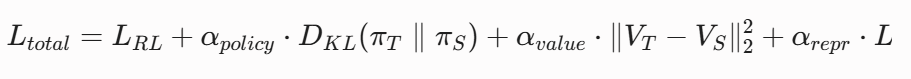
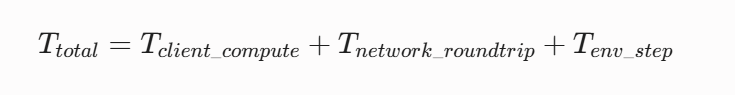

# Light-weight Image-Based RL Toolkit for Low-End Hardware

**<u>Status</u>**: Draft - Pre-Issue Prototyping

**<u>Target Architecture</u>**: External Companion Toolkit for huggingface/OpenEnv(envs/atari_env) or a plug-n-play system for OpenEnv

**<u>Last Updated: </u>**: 2026-06-20

## <u>Summary of Problem Statement </u>
### <u>Challenge<u>
Image-Based Reinforcement Learning(RL) Projects often take long training time, slow iterations, thousands of epochs of training run as well as large wall-clock time, especially in low-end GPUs, such as Intel Iris Xe, Nvidia MX450, AMD Radeon RX 6400 LP. This makes experimentation, development and benchmark validation slow and costly. The following problems are a result of the hardware bottleneck:
    
-> **Protracted Iteration loops and Slow Feedback Loop:** Long wall-clock training is preventing rapid prototyping and tuning of architectures and hyper-parameters, causing slow feedback loop.
-> **Low Sample Efficiency:** Heavy models need more Environment steps to reach good rewards, extract useful spatial representations, compounding the compute deficit.
-> **Network & IPC Overhead:** When using distributed or containerized environment interfaces like **OpenEnv**, transferring high-resolution raw pixel tensors(84x84x4 frame stacks) over a client-server boundary such as HTTP/WebSocket loopback introduces substantial *IPC*(Inter-Process Communication) *latency* that can easily dwarf model forward-pass times on low-end Host CPUs.

### <u> Proposed Solution </u>
The following toolkit acts as a proof of concept for a highly optimized reproducible workflow. Inspired by *Software-based Optimization* methods, this toolkit aims to lower the barrier of entry for image-based RL. Instead of training complex agents from scratch on constrained devices, this project introduces a standalone companion toolkit that pairs KD(Knowledge Distillation) with hardware-aware structural optimizations. By leveraging a high-performing, pre-trained teacher model, we distill its policy, value outputs and internal representations into an ultra-lightweight student-network optimized specifically for low-VRAM, lower compute target devices.

## <u> Technical and Design Decisions </u>

### (I) Environment Interoperability: How does OpenEnv and atari_env fit in?

-> OpenEnv acts **strictly** as an *environment interface* and *network abstraction layer* rather than a training library. It isolates the environment runtime inside a Docker Container and exposes state interactions asynchronously. In order to maximise throughput on low-end devices, this project interfaces with **envs/atari_env** under **HuggingFace/OpenEnv** using the following strategies:
       (i) **Server-Side minimization:** We configure atari_env container to handle downsampling and grayscale conversion natively, rather than pulling heavy RGB Frames across the container side and processing them in client side. This can be achieved natively using environment variables(ATARI_OBS_TYPE=grayscale, ATARI_FRAMESKIP=4). This drastically reduces the network serialization payload per step.
      (ii) **Idiomatic Custom Transformers:** Client-side frame stacking and final tensor formatting are implemented by extending *openenv.core.Transform*. This ensures seamless integration with OpenEnv's data structures while keeping local client runtime lean.

### (II) Procurement of Teacher Policy

-> To avoid spending critical hardware cycles and falling into a compute trap, the teacher model will **not** be trained from scratch. Instead, the toolkit pulls verified, high-performance pre-trained weights (for example, Standard NatureCNN checkpoints from open-source baselines like CleanRL or Stable-Baselines3). A structural adapter maps these static state-dicts to our local PyTorch environment, providing an immediate, high-fidelity training signal for behavioral cloning and distillation.

### (III) Student Backbone Selection and Hardware Safeguards

-> Although *MobileNetV3-Small* serves as the default student encoder due to its minimal parameter footprint, its heavy reliance on *depthwise-separable convolutions* can occasionally encounter memory-bandwidth bottlenecks on low-end desktop or integrated laptop GPUs.

-> Alongside *MobileNetV3*, the toolkit implements a highly optimized *Shallow ResNet(Mini-ResNet)* config as a fast ablation alternate(controlled removal or modification of a component in the Neural Network). This allows users to benchmark which layer composition achieves superior hardware utlization on their specific silicon.

### (IV) Distillation Loss Formulation
-> The student network is optimized via a joint loss function that enforces alignment across action selection, value estimation, and latent space representations:

Where:
  (i) $L_{RL}$ is the *Standard Environment Task loss* (eg: PPO, or PPO clipped objectives)
  (ii) $D_{KL}(\pi_{T} \parallel \pi_{S})$ represents the Kullback-Liebler divergence between the teacher and student policy distributions, scaled by the temperature parameter, *T*
  (iii) $\|V_{T} - V_{S}\|_2^2$ is the $L_2$ loss matching the student's value network predictions directly to the teacher's state-value estimates.
  (iv) $L_{repr}$ is an optional MSE(Mean Square Error) loss enforcing alignment between projected latent features of both encoders.

### (V) Quantization and Inference Export
-> Post-Training Quantization (PTQ) directly into *INT8* using standard PyTorch frameworks is primarly optimized for x86 CPUs and often experiences limited performance gains or runtime bugs on low-end GPUs. To resolve this, the toolkit exports the fully distilled PyTorch student model to the *ONNX Runtime* ecosystem, applying the device-targetted quantization or FP16 execution explicitly optimized for low-end graphics cards.

## <u> Project Setup, Environment, and Dependencies </u>
-> This project is structured as an independent companion repository that consumes *openenv-core* API Client.

### (I) Core Stack and Version Matrix
Library/Dependency | Version | Purpose
Python             | 3.11.x  | Base language runtime offering optimal performance and ecosystem stability.
torch              | 2.5.1   | Core ML framework utilized for student network execution and joint loss computation.
torchvision        | 0.20.1  | Source library for standard MobileNetV3 backbones.
openenv-core       | 0.2.0   | Client-side environment communication protocol layer.
atari-env          | 0.2.0   | Client bindings specifically targeting the Arcade Learning Environment.
stable-baselines3  | 2.4.0   | Utilized strictly for sourcing and mapping pre-trained NatureCNN teacher checkpoints.
onnx               | 1.17.0  | Open Neural Network Exchange graph serialization format.
onnxruntime-gpu    |1.20.0   | High-efficiency deployment engine optimized for CPU and low-end GPU targets.
ruff               |0.9.1    | Fast linter and code formatter matching standard upstream constraints.

## <u> Staged Implementation Plan</u>
### **Phase 0: Environment and IPC Overhead Benchmarking** 
-> Run the local *atari_env* Docker container image
-> Implement a diagnostic test script to measure a baseline step latency using a completely random/no-op policy
-> Calculate and Record pure network RTT (round-trip time - IPC Overhead) to serve as a baseline value that can be cleanly separated from the model compute metrics in subsequent phases.
#### Logical and Mathematical Trace: Phase 0:

->**Random Agent Operator:**
   (i) At this stage, we have no neural network. The agent selects an action 
   *(a(t))* at time t, by sampling uniformly from the discrete atari action space (*A*):
       $$a_t \sim \mathcal{U}(A)$$
   (ii) **The Processing Pipeline:**
      (a) **Client Request:** Client sends an action *a(t)* via HTTP/WebSocket to the *atari_env* Docker container
      (b) **Environment Step:**The Emulator (ALE) transitions from a state *s(t)* to *s(t+1)*, generating a reward *r(t+1)* and a boolean flag indicating if the episode is done.
      (c) **Server-Side Downsampling:**This is the first lightweight optimization. Instead of sending RAW RGB frames, the server processes the image based on our environment variables(*ARARI_OBS_TYPE=grayscale, ATARI_FRAMESKIP=4*)
      (iv) **Client Receives data:** The tuple(*s(t+1)*, *r(t+1)*, done) is serialized, transmitted and deserialized into Python objects.
#### Math of 'Making it Lightweight'
-> Raw RGB Frame is represented as: 210 X 160 X 3 channels = 100,800 Bytes.
-> Grayscale Downsampled frame is represented as: 84 X 84 X 1 channel = 7056 Bytes.
->We achieve an approximate 14x reduction in network payload size/ environment step by moving the preprocessing to the server.
->For the Baseline IPC Benchmark, we calculate the total time taken for one step:
   
Since the agent chooses a random integer, *T(client_compute*) ~ 0. Hence, any latency measured in the test script isolates exactly how long the OpenEnv network and emulator overhead takes. This acts as our *Zero Point* benchmark.

**Breakdown of the IPC Connection:**

[CLIENT-SIDE]                 [IPC LAYER]                 [SERVER-SIDE (DOCKER)]
+----------------------+      +--------------------+      +----------------------+
|                      |      |                    |      |  Arcade Learning     |
| 1. Sample Action     |====> | 2. Send JSON via   |====> |  Environment (ALE)   |
|    a_t ~ U(A)        |      |    HTTP/WebSocket  |      |                      |
|                      |      |                    |      | 3. Step Emulator     |
+----------------------+      +--------------------+      |    s_t -> s_{t+1}    |
                                                          +----------------------+
                                                                     ||
[CLIENT-SIDE]                 [IPC LAYER]                            \/
+----------------------+      +--------------------+      +----------------------+
|                      |      |                    |      | 4. Server-Side       |
| 6. Custom Transform  | <=== | 5. Return Grayscale| <=== |    Downsampling      |
|    (History Buffering|      |    7,056 bytes     |      |    (14.2x reduction) |
|     & Frame-Stacking)|      |                    |      |                      |
+----------------------+      +--------------------+      +----------------------+
#### Issues in Phase 0:
-> Multiple issues related to client script and the running processes being out of sync regarding how they format the data packets. These bugs are listed as follows:
   (i) Shape Mystery (Got (100800,)):
      If we observe the dimension calculation: 210 X 160 X 3 = 100800
      This tells two critical issues:
      (a) The server completely ignored our *ATARI_OBS_TYPE=grayscale* environment flags set inside PyTest. Since the server process was executed manually using *uv run* in a separate shell, it cannot see the environment variables injected into the PyTest terminal.

      (b) The server is transmitting the raw uncompressed, full color RGB Frame as a flattened 1D array of 100,800 numbers over the WebSocket.
   
   (ii) The Action Formatter Crash('int' object is not iterable):
        The Stack trace inside the openenv/core/generic_client.py explicitly revealed the internal data normalization contract: 
        *return dict(action)* ##Crashed here when given an integer.
      The GenericEnvClient requires actions to be in a dictionary wrapper but the server expects internal mapping payload keys to be exact.        
#### Solutions:
   (i) Duck-Typing the Client Constraint:
   We can use a simple duck-typing pattern to satisfy both layers. By wrapping the action in a lightweight mock object that implements a *.model_dump()* method, we pass right through the client's filter and deliver raw integer scalar directly to the wire socket.
   (ii) Handling flatteing and color space directly in test script: By dynamically parsing the array shape, we can reshape our flattened array of 100,800 elements to its true raw dimensions(210,160,3) or downsample it.
  (iii) Align the dictionary action wrapper: The generic client requires a dict wrapper, hence we shall use the standard structural frame key wrapper *{"value":1}* or generic format, ensuring it passes the internal isinstance (action, dict) gate safely.

#### *Phase 0 Status:* 
Connection established! We have completely bypassed the Pydantic validation wall. The test has successfully executed 10 full benchmark rounds plus warmup iterations without throwing as single server error or dropping the connection.

*test log:*
 pytest .\tests\test_ipc_baseline.py --benchmark-sort=mean
============================= test session starts =============================
platform win32 -- Python 3.11.5, pytest-8.2.0, pluggy-1.6.0
benchmark: 5.2.3 (defaults: timer=time.perf_counter disable_gc=False min_rounds=5 min_time=0.000005 max_time=1.0 calibration_precision=10 warmup=False warmup_iterations=100000)
rootdir: \Image_RL_Optimizer
configfile: pyproject.toml
plugins: anyio-4.14.0, benchmark-5.2.3
collecting 2 items                                                            collected 2 items                                                              

te.                                            [100%]

============================== warnings summary ===============================
venv\Lib\site-packages\opentelemetry\util\_importlib_metadata.py:32
  \Image_RL_Optimizer\venv\Lib\site-packages\opentelemetry\util\_importlib_metadata.py:32: DeprecationWarning: SelectableGroups dict interface is deprecated.Use select.
    return EntryPoints(ep for group_eps in eps.values() for ep in group_eps)

-- Docs: https://docs.pytest.org/en/stable/how-to/capture-warnings.html

----------------------------------------------------- benchmark: 1 tests -----------------------------------------------------
Name (time in ms)                     Min       Max     Mean   StdDev   Median    IQR  Outliers      OPS  Rounds  Iterations
------------------------------------------------------------------------------------------------------------------------------
test_random_agent_ipc_latency     44.3017  115.3127  63.2626  25.0615  51.327121.0647       2;2  15.8071      10           1
------------------------------------------------------------------------------------------------------------------------------

Legend:
  Outliers: 1 Standard Deviation from Mean; 1.5 IQR (InterQuartile Range) from 1st Quartile and 3rd Quartile.
  OPS: Operations Per Second, computed as 1 / Mean
======================== 2 passed, 1 warning in 9.53s =========================

#### Data Breakdown:
   -> **Mean Latency(63.26ms):** On average, a single *step()* takes about 63ms to travel to server, execute the Pong env and return to the New State.
   -> **Variance/Stability(StdDev=25.06ms):** There seems to be a significant jitter here. The minimum time was supposed tobe 44.3ms, but spiked upto 115.3ms. This suggests network stack overhead, garbage collection, or unpredictable serialization times getting in the way.
   -> **Throughput/OPS(15.8):** Currently operating at 15.8 Operations/Environment steps/ Second.

   Although the *connection* is a *stable* one, *15.8 steps/second* is still a severe bottleneck for Reinforcement Learning. To put it into perspective in our case, a standard native Gym instance of the Atari Pong can push easily about 1000-2000 steps per second. At around ~15 OPS, training a high-performance agent will take an eternity. This massive overhead is due to the *JSON-Serializing* and *Deserializing* of the raw 201X160X3(100,800 element) observation array over the loopback interface on every single step.

### **Phase 1: Teacher Weight Mapping**
-> Download pre-trained NatureCNN weights for *PongNoFrameskip-v4* and *BreakoutNoFrameskip-v4*.
-> Construct a light-weighted state-dict parser to load the weights into a local PyTorch module.
-> Run evaluation rollouts against the *atari_env* client wrapper to verify performance parity with published baselines.

### Approach for Phase 1:
-> **Strategy- Optimize the Pipeline without changing the payload:**
    (i) In order to lower the bar for target consumer systems while preserving the vanilla 210 X 160 X 3 image payload, we must forget *how* exactly the data is moved. 
    (ii) Currently, our CLI Binary in the virtual env is likely serializing raw observations into massive JSON lists. JSON parsing of a 100,800 element array in Python will be notoriously slow and CPU-Bound.
    (iii) Before building the entire toolkit, I propose adding our *Phase 1 Optimization* by moving away from JSON lists serialization to a compact binary or zero-copy protocol(like Protobuf, Msgpack, or Shared Memory IPC) within the OpenEnv communication layer. This strips the serialization overhead touching without the underlying game states.

### Steps so far:
   -> Clone/Fork the Repository to your system using:
   *git clone https://github.com/huggingface/OpenEnv.git*

   -> Setup a Virtual env using: 
       *python 3.11 -m venv venv (in Windows)*
       OR

   -> Activate the venv using:
      *.\venv\Scripts\activate* (in Windows)
      OR

   -> Install the packages and dependencies in requirements.txt using *pip install -r requirements.txt*

   -> Setup a server port in one terminal for IPC
    *uv run --python 3.11 --project . server --port 8000*
   -> Split the terminal to run the Phase 0 test script using:
     *pytest .\tests\test_ipc_baseline.py --benchmark-sort=mean* 
